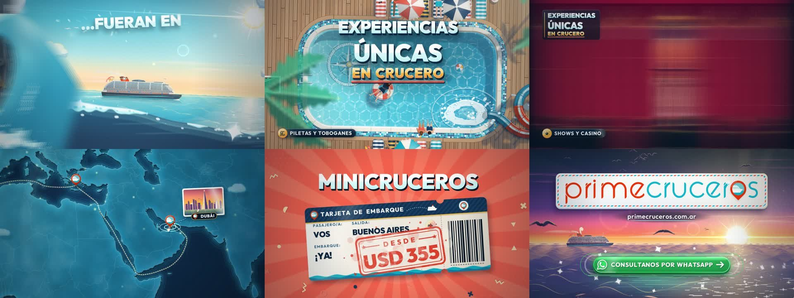
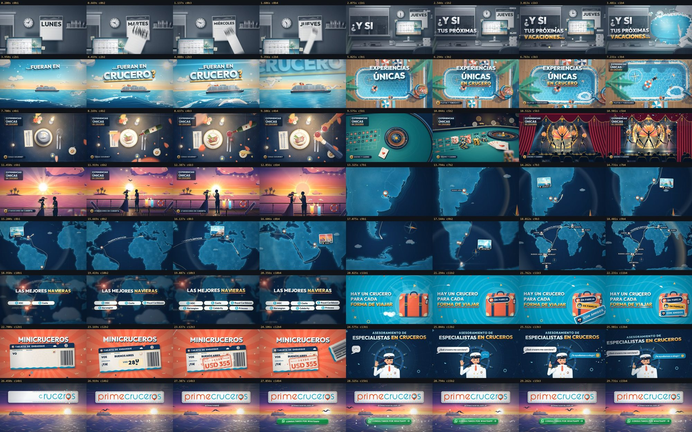

# Prime Cruceros · promo de 30 s hecha con código

Video promocional de 30 segundos (1920×1080, 60 fps) para **Prime Cruceros**, una agencia argentina especializada en
cruceros. Es motion graphics 100 % generado por código: no tiene capturas, videos de stock ni imágenes generadas por IA.
Todo es código:
- **Ilustración y animación**: Canvas 2D.
- **Música y efectos de sonido**: sintetizados en Python, sin samples.
- **Tipografía cinética**: motor propio.



**Arco**:
1. **Gancho**: una rutina gris de oficina que se lleva una ola.
2. **Revelación**: mar abierto con el crucero (el *drop* de la música).
3. **Experiencia a bordo**: pileta → cena → casino y show → atardecer, encadenados por match cuts circulares.
4. **Destinos**: una ruta que se dibuja sobre el mapamundi, con pines y postales.
5. **Navieras**.
6. **Valor**: valija, tarjeta de embarque y especialistas.
7. **Cierre**: logo, URL y «CONSULTANOS POR WHATSAPP →».

Todo el texto en pantalla está en español rioplatense.



## Documentación

- [`docs/PROCESO.md`](docs/PROCESO.md): **cómo se generó**. Equipos de agentes, rondas de crítica, métricas de calidad
  y problemas que aparecieron.
- [`docs/CODIGO.md`](docs/CODIGO.md): **cómo está hecho el código**. Motor, escenas, audio, render y una **guía de
  cambios** (dónde está cada texto, el precio, los colores, los tiempos y la música).
- [`docs/PLAN.md`](docs/PLAN.md): el contrato de producción (storyboard con tiempos, dirección de arte, lenguaje de
  movimiento).
- [`src/art/README.md`](src/art/README.md) y [`audio/README.md`](audio/README.md): el kit de ilustración y el audio
  en detalle.

## Cómo funciona

- **Un solo motor, dos plataformas** (`src/engine/`). Cada cuadro es una **función pura del tiempo** `t`.
  - El mismo código dibuja la vista previa en vivo en el navegador (con la música sincronizada).
  - Y el render final en Node con Skia (`@napi-rs/canvas`): sin navegador ni GPU, determinista (el mismo `t` da
    siempre los mismos píxeles).
- **Grilla musical única** (`src/cues.json`): 128 BPM, así que 16 compases son 30,000 s exactos.
  - Los 65 golpes (cues) los leen la imagen y el audio, así que cada corte, pop y pin cae en el beat.
- **Escenas** (`src/scenes/`): cada una es un módulo con `init()` y `draw(ctx, t)`, opcionalmente con `mask` y
  `over` para las transiciones. Las ilustraciones van en módulos chicos por carpeta.
- **Kit compartido** (`src/art/`): cielo, sol y flares, mar, crucero, la ola de las transiciones, ojo de buey,
  gaviotas, trópico y agua (ver `src/art/README.md`).
- **Marca** (`src/brand/`): el pin del logo (hilo conductor de la pieza), el logo vectorizado y el ícono de WhatsApp.
- **Audio** (`audio/`): tropical house en La mayor, armado de cero.
  - Síntesis: osciladores, filtros, reverb por convolución, sidechain y limitador true-peak.
  - Arreglo compás por compás, 41 tipos de efectos sincronizados a ±2 ms y análisis automático.
  - Ver `audio/README.md`.
- **Contrato de producción**: `docs/PLAN.md` (storyboard con tiempos, dirección de arte, lenguaje de movimiento,
  contratos entre escenas y lecciones técnicas).

## Requisitos

- Node.js 22
- Python 3.12 con `numpy`, `scipy`, `numba` y `matplotlib` (solo para regenerar el audio)
- `ffmpeg` en el PATH

```bash
npm install
```

## Uso

```bash
npm run dev
```

Abre la vista previa en vivo en http://localhost:5181. Espacio reproduce o pausa, ←/→ avanza un cuadro y Shift+←/→
un beat. `?t=12.5` arranca en ese segundo.

```bash
node tools/render.mjs
```

Hace el render final a `out/promo-prime-cruceros.mp4` (1920×1080, 60 fps, motion blur ×6). Tarda ~7 min con 10
procesos en una CPU de 32 hilos.

```bash
node tools/render.mjs --draft
```

Hace un borrador rápido a `out/draft.mp4` (960×540, 30 fps). Acepta `--from=A --to=B` para renderizar solo un
tramo.

```bash
node tools/still.mjs --from=3.4 --to=4.2 --step=0.0333 --sheet
```

Genera cuadros sueltos y hojas de contactos en `shots/`.

```bash
node tools/check.mjs
```

Verifica la pieza completa: errores, determinismo y ms por cuadro.

```bash
node tools/energy.mjs --video=out/draft.mp4
```

Mide la energía de movimiento por beat y el salto de luz en cada corte.

```bash
npm run audio
```

Regenera `public/audio/promo.wav` y lo verifica (−14 LUFS, true peak ≤ −1 dBTP y sincronía de los efectos).

```bash
node tools/fingerprint.mjs --out=huella.json
```

Guarda la huella de píxeles de la pieza. Después de un cambio, compará con `--compare=huella.json`: confirma que no
se tocó la imagen.

### Versión vertical (9:16)

El motor ya renderiza en 1080×1920 (`--format=9x16` en las herramientas, `?format=9x16` en la vista previa), y el
contrato de composición vertical está en `docs/PLAN.md` §13. Las escenas todavía no están adaptadas: hoy solo el
16:9 está terminado.

## Estructura

```
src/engine/     motor: tiempo y cues, easing y resortes, ruido, color, dibujo, cámara 2.5D, texto, fx, grade, compositor
src/scenes/     escenas (hook-office, reveal-sea, pool, dinner, show, sunset, map, value, close, type-*) y sus módulos
src/art/        kit de ilustración compartido
src/brand/      pin, logo y WhatsApp
src/data/       mapamundi precalculado (Natural Earth vía world-atlas y d3-geo; tools/build-map.mjs)
audio/          síntesis, arreglo, SFX, mezcla y análisis (Python)
tools/          vista previa en Node, render paralelo, verificación
public/         fuentes (Outfit), assets de marca, audio final
docs/           contrato de producción y referencias
```

Los archivos que empiezan con `_` dentro de cada carpeta son pruebas y mediciones que se usaron durante la
producción.

## Créditos y licencias de terceros

- Marca, logo y textos: **Prime Cruceros** (https://primecruceros.com.ar). Los assets de marca se incluyen solo como
  referencia de este proyecto.
- Tipografía: [Outfit](https://fonts.google.com/specimen/Outfit) (SIL Open Font License).
- Datos del mapa: [Natural Earth](https://www.naturalearthdata.com/) (dominio público), vía `world-atlas`.
- Ícono de WhatsApp: glifo propio, solo como señal del CTA. WhatsApp es marca de Meta.
- Las navieras (MSC, Costa, Royal Caribbean, Norwegian, Celebrity, Princess) aparecen solo como texto.
